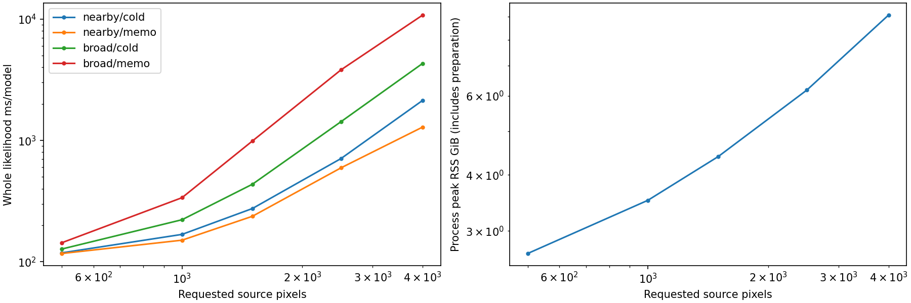
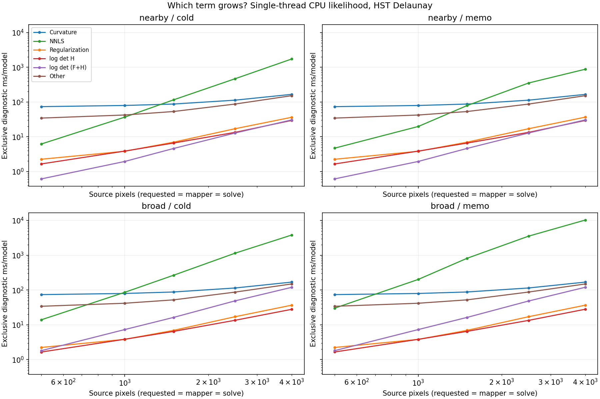

# Numba CPU likelihood source-pixel scaling — phase 6

Issue: [#282](https://github.com/PyAutoLabs/autolens_profiling/issues/282).
All five source-pixel counts pass the declared numerical, timing, completeness and thread-configuration gates. Production behavior is unchanged.

## Question and scope

How does the complete single-threaded CPU likelihood scale with source-pixel
count, which terms dominate, and how does the production NNLS memo change that
answer for nearby versus broad proposals? This follows phases 5 and 5b. It does
not promote their unsuccessful residual-based memo policy or alter a library.

HST imaging, Delaunay, fp64, production numba `_sparse` assembly and positive-only
solve. The dense source curvature system remains part of this sparse imaging
assembly API; this is not a new matrix-free solver. Requested source counts are
500, 1000, 1500, 2500 and 4000. Actual mapper and solve dimensions are recorded
separately. Lens light is solved and subtracted separately for each model before
timing, following the established phase-5 preparation.

## Design implications

The measured bottleneck changes with source resolution. Curvature dominates the
smallest systems, but NNLS overtakes it as N grows. A single headline speed-up at
N1500 therefore does not describe the full CPU workload. Larger-N optimization
should be judged against complete likelihood timing, with NNLS now a candidate
for further investigation; these measurements themselves do not speed up the
production library.

At N=4000, nearby draws fall from 2.138 s/model cold to 1.289 s/model
with memo reuse (39.7% less time), while broad draws rise from 4.312 to
10.783 s/model (2.50 times the cold cost). NNLS accounts for approximately
68–95% of whole-call time across the four lanes at that size.

Source size alone is insufficient to choose whether to use the memo: at the
same N it helps nearby proposals and penalizes broad ones. The earlier residual
precheck remains unpromoted. Phase 7 should compare cold and existing-memo CPU
configurations on HST and Euclid with representative proposal histories before
making a production recommendation. These short synthetic sequences do not
establish a global default or an end-to-end sampler speed-up.

Reducing source pixels lowers computational cost, but this study does not test
reconstruction fidelity across resolutions. Choose the required resolution from
the science, then use the timing and matrix-memory tables to budget it. The
harness RSS values are not direct per-worker memory recommendations.

## Measurement design

The seed-601 declaration is persisted before any model preparation. It contains
8 nearby cumulative 0.05-prior-sigma steps and 8 independent broad draws at
5 prior sigma, without clipping. The exact same parameter sequence is used at
every source count. These are controlled proposal sequences, not posterior
samples or measurements of sampler throughput.

Each lane starts with an empty production NNLS memo. The first model is cold;
later models may reuse the preceding memo history. Six sequence traversals per
lane counterbalance cold/memo order and clean/instrumented order. Compilation
and preparation are excluded from clean full `AnalysisImaging` likelihood times.
Diagnostic and clean traversals are separate, and no instrumentation is installed
in clean calls. Headline values are median sequence totals divided by 8, not the
mean of unrelated best-per-model timings.

Exclusive instrumentation attributes curvature, regularization assembly, the
actual positive-only NNLS callable, and both determinant terms. Nested work is
subtracted from parents; `other` is the full-call remainder. Inclusive timings
are retained but must not be added together. A breakdown is interpretable only
when its observed sequence median reconciles with the clean median within 5%.
Each raw exclusive decomposition must also close to its own full-call duration.

Numerical checks compare cold versus memo at the same model and N: unchanged
phase-5 evidence tolerance (1e-9 relative), exact active-set membership, finite
same-shaped reconstructions with residual differences reported. Every clean and
instrumented timing's evidence is compared with the corresponding diagnostic
lane. Solutions at different N are not required to agree: those are different
source discretizations.

Every N runs in a fresh process. Peak RSS includes imports, compilation, both
sequence groups and preparation, with eight prepared Analysis cells retained at
a time. It is a harness high-water mark, not the memory of one production
likelihood. Exact curvature-plus-regularization matrix bytes are reported
separately. The group snapshots are cumulative process maxima, not incremental
allocations. Linux SLURM MaxRSS is independent supporting evidence.

Log-log exponents and R² are descriptive fits over these five measured sizes,
not proofs of asymptotic complexity. Crossover brackets require adjacent measured
cells with all gates passing; no extrapolation or interpolation over missing
cells is permitted. An empty bracket list means no crossing was observed within
the measured range, not that a crossing cannot exist. Missing, failed or timed-out
sizes remain explicit in the summary.

## Validation and provenance

Before the RAL sweep: 15 focused tests, Ruff/format, import, shell syntax and
README idempotence checks passed; independent implementation review CLEAN.
Local N=100 and N=1500 smokes passed numerical checks, but their overlapping CPU
work invalidates timing comparisons; those timings are excluded from results.
The RAL run uses the final counterbalanced instrumentation schedule.

Private source snapshot based on merged PR #281 (`fb303cf`), with 48 hashed
inputs checked before execution. Libraries are read from the RAL installation;
their exact revisions, rather than potentially stale version labels, identify
the stack. BLAS environment pins and observed runtime pool counts are recorded
separately; an empty `threadpoolctl` result means runtime BLAS count unavailable.
No shared library refresh is part of this task.

All five cells have been retrieved and the cross-N JSON/PNG regenerated with
`--aggregate`. The [source and job record](fixed_light_numba_s6_source_jobs.json)
contains input hashes, library revisions, SLURM completion and resource records,
and the lossless JSON-formatting manifest.

## Results

Median complete-sequence milliseconds per model; six fresh-cache traversals per lane.

| Source pixels | Nearby cold | Nearby memo | Broad cold | Broad memo | Peak RSS GiB |
|---:|---:|---:|---:|---:|---:|
| 500 | 118.562 | 117.082 | 127.461 | 143.595 | 2.672 |
| 1000 | 168.318 | 150.803 | 222.342 | 337.748 | 3.512 |
| 1500 | 274.940 | 237.358 | 435.782 | 989.708 | 4.396 |
| 2500 | 709.840 | 595.186 | 1428.872 | 3819.675 | 6.185 |
| 4000 | 2137.865 | 1288.876 | 4312.031 | 10782.596 | 9.085 |

### Exclusive breakdown

Diagnostic ms/model, median sequence totals per component. Independent component medians need not sum exactly to the median whole call; raw per-call exclusive sums close exactly up to floating roundoff.

| N | Sequence | Lane | Curvature | NNLS | Regularization | log det H | log det F+H | Other |
|---:|---|---|---:|---:|---:|---:|---:|---:|---:|
| 500 | nearby | cold | 73.503 | 6.194 | 2.258 | 1.655 | 0.614 | 34.468 |
| 500 | nearby | memo | 73.433 | 4.719 | 2.257 | 1.655 | 0.616 | 34.442 |
| 500 | broad | cold | 73.802 | 13.940 | 2.231 | 1.650 | 1.803 | 34.083 |
| 500 | broad | memo | 73.831 | 30.181 | 2.231 | 1.657 | 1.809 | 34.046 |
| 1000 | nearby | cold | 79.429 | 36.696 | 3.838 | 3.874 | 1.950 | 42.257 |
| 1000 | nearby | memo | 79.376 | 19.769 | 3.830 | 3.869 | 1.952 | 42.212 |
| 1000 | broad | cold | 79.621 | 86.024 | 3.822 | 3.836 | 7.299 | 41.667 |
| 1000 | broad | memo | 79.643 | 201.844 | 3.809 | 3.817 | 7.296 | 41.684 |
| 1500 | nearby | cold | 87.316 | 115.434 | 6.992 | 6.603 | 4.604 | 53.252 |
| 1500 | nearby | memo | 87.342 | 78.945 | 7.000 | 6.586 | 4.619 | 53.181 |
| 1500 | broad | cold | 87.772 | 266.110 | 6.920 | 6.458 | 16.309 | 52.105 |
| 1500 | broad | memo | 87.865 | 818.413 | 6.928 | 6.471 | 16.313 | 52.170 |
| 2500 | nearby | cold | 112.895 | 466.539 | 17.058 | 13.394 | 12.814 | 87.243 |
| 2500 | nearby | memo | 112.766 | 351.909 | 17.037 | 13.392 | 12.840 | 87.076 |
| 2500 | broad | cold | 114.473 | 1146.456 | 17.086 | 13.495 | 48.801 | 87.089 |
| 2500 | broad | memo | 114.572 | 3542.028 | 17.089 | 13.402 | 48.318 | 87.448 |
| 4000 | nearby | cold | 165.809 | 1723.400 | 36.321 | 29.511 | 30.558 | 151.879 |
| 4000 | nearby | memo | 165.436 | 874.455 | 36.588 | 29.441 | 30.498 | 151.727 |
| 4000 | broad | cold | 169.039 | 3811.245 | 36.637 | 27.852 | 119.434 | 149.486 |
| 4000 | broad | memo | 168.882 | 10273.406 | 36.603 | 27.998 | 119.839 | 149.196 |

### Descriptive scaling fits and crossovers

| Sequence/lane | Whole-call log-log exponent | R² |
|---|---:|---:|
| nearby/cold | 1.397 | 0.9204 |
| nearby/memo | 1.192 | 0.9238 |
| broad/cold | 1.728 | 0.9524 |
| broad/memo | 2.155 | 0.9794 |

NNLS/curvature equality is bracketed only by adjacent passing measured sizes:

- nearby/cold: 1000–1500 pixels.
- nearby/memo: 1500–2500 pixels.
- broad/cold: 500–1000 pixels.
- broad/memo: 500–1000 pixels.

### Numerical and timing evidence

All 80 paired comparisons pass exact active-set membership and the unchanged relative-evidence gate. Maximum evidence error is 5.23869e-10 nats absolute / 2.43191e-13 relative; maximum relative reconstruction difference is 1.87203e-12. All 960 clean and 960 instrumented evaluations agree with their respective diagnostic evidence. Worst clean/observed median discrepancy is 0.265%.

Requested, mapper and solve dimensions coincide for every draw in these cells. The dense curvature-plus-regularization matrix uses 8 N² bytes: 500: 2,000,000 bytes, 1000: 8,000,000 bytes, 1500: 18,000,000 bytes, 2500: 50,000,000 bytes, 4000: 128,000,000 bytes. These bytes are one matrix, not total working memory.

### Reproduction

Jobs: `343430_0` (N500) and `343445_1` through `343445_4` (N1000/1500/2500/4000), serial execution. CPU node `euclid-ral-gpu-1`, AMD EPYC 7702, 124 online logical CPUs; each task allocated one CPU, 64 GiB and four hours, no GPU. BLAS environment pins are one; Numba runtime reports one; BLAS runtime pool count is unavailable (`threadpoolctl=[]`).

[Machine-readable cross-size summary](../breakdown/imaging/fixed_light_numba_scaling_summary_hpc_ral_cpu_fp64_fixed_light_numba_s6.json) retains input hashes, raw fitted points, missing/failed status handling and measured crossover brackets. Per-N JSON files beside it retain every timing, numerical comparison, solver diagnostic, declaration and provenance record.
